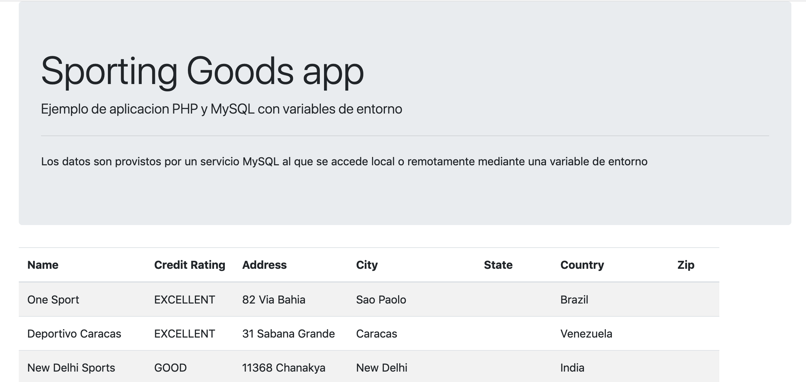

## OpenStack

Ejemplos variados que concluyen con aplicación PHP de ejemplo para Sporting Goods sobre una base de datos MySQL. La aplicación se despliega con Terraform en dos máquinas virtuales (mysql y webapp) sobre OpenStack-DI.

### Configuración de `01-one-instance`

Edita el archivo `01-one-instance/variables.tf` y configura estas variables: 

* `openstack_user_name`: Nombre de usuario OpenStack-DI.
* `openstack_tenant_name`: Nombre de proyecto OpenStack-DI donde realizar el despliegue.
* `openstack_password`: Password del usuario.
* `openstack_keypair`: Nombre del archivo de clave pública en tu proyecto para inyectar a las instancias creadas.

### Configuración del resto de ejemplos 

* Define en la shell una variable de entorno denominada `TF_VAR_PASSWORD` inicializada con tu contraseña de OpenStack-DI
* Edita el archivo `<0x-example>/variables.tf` y configura estas variables: 

* `openstack_user_name`: Nombre de usuario OpenStack-DI.
* `openstack_tenant_name`: Nombre de proyecto OpenStack-DI donde realizar el despliegue.
* `openstack_keypair`: Nombre del archivo de clave pública en tu proyecto para inyectar a las instancias creadas.

## GCP

Ejemplos variados que concluyen con un depsliegue Docker Compose con una aplicación PHP de ejemplo para Sporting Goods sobre una base de datos MySQL. La aplicación se despliega creando una instancia con Terraform a la que se le instala Docker y Docker Compose con un script de inicialización.

### Configuración

* [Descarga las credenciales del proyecto GCP](https://cloud.google.com/iam/docs/creating-managing-service-account-keys#creating_service_account_keys) y guárdalas en un archivo `gcp-identity.json`.
* En cada carpeta de ejemplo, configura las variables `gcp-username` y `gcp-project` con sus valores correspondientes.

## Despliegue

Dentro de cada carpeta de ejemplos ejecuta:

```
$ terraform init
$ terraform apply
```

Tras unos instantes se mostrarán las IPs asignadas a las máquinas virtuales creadas y aprovisionadas.

## Resultado

Una vez realizado el despliegue hay que dejar pasar un par de minutos para que se descarguen los paquetes a las máquinas virtuales y se configure la base de datos de ejemplo y la aplicación web.



> **INFORMACION**
> 
> El acceso a la BD en MySQL es mediante el usuario `sg` y el password `my_password`.
